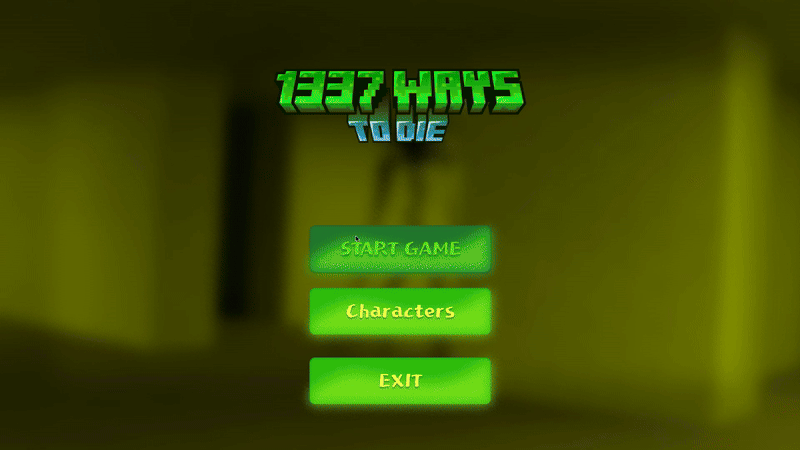
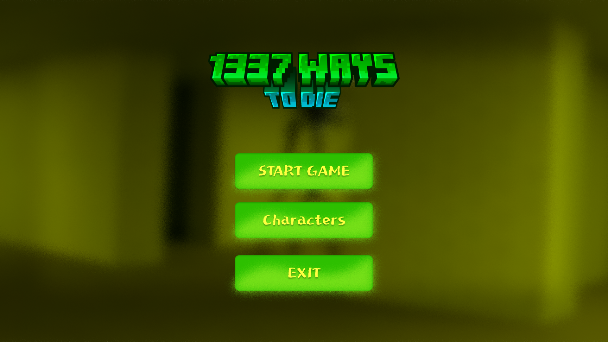
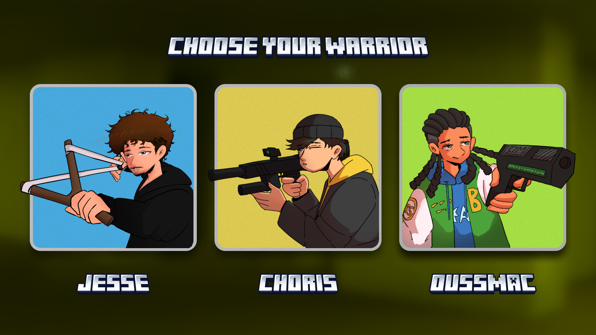
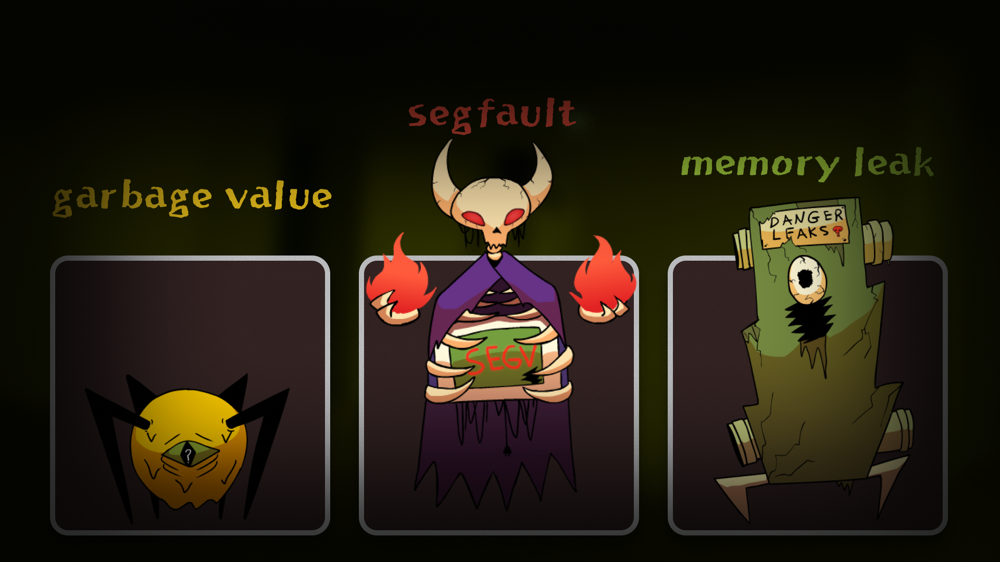
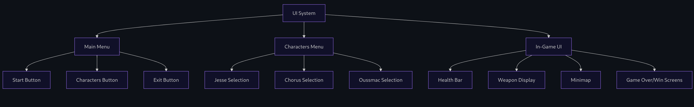
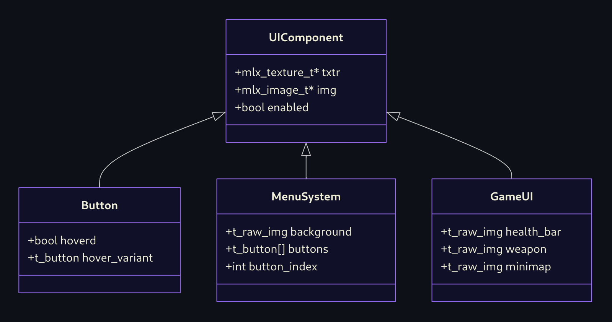
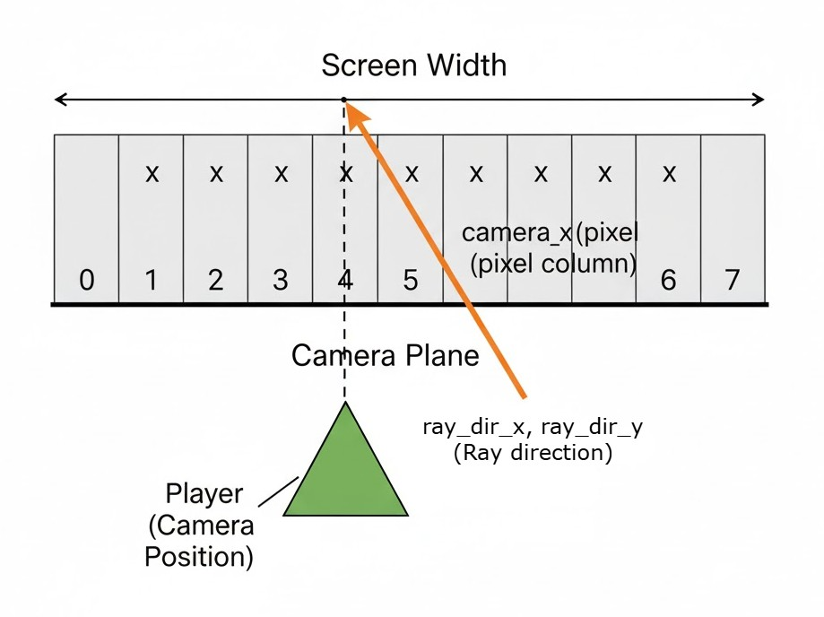
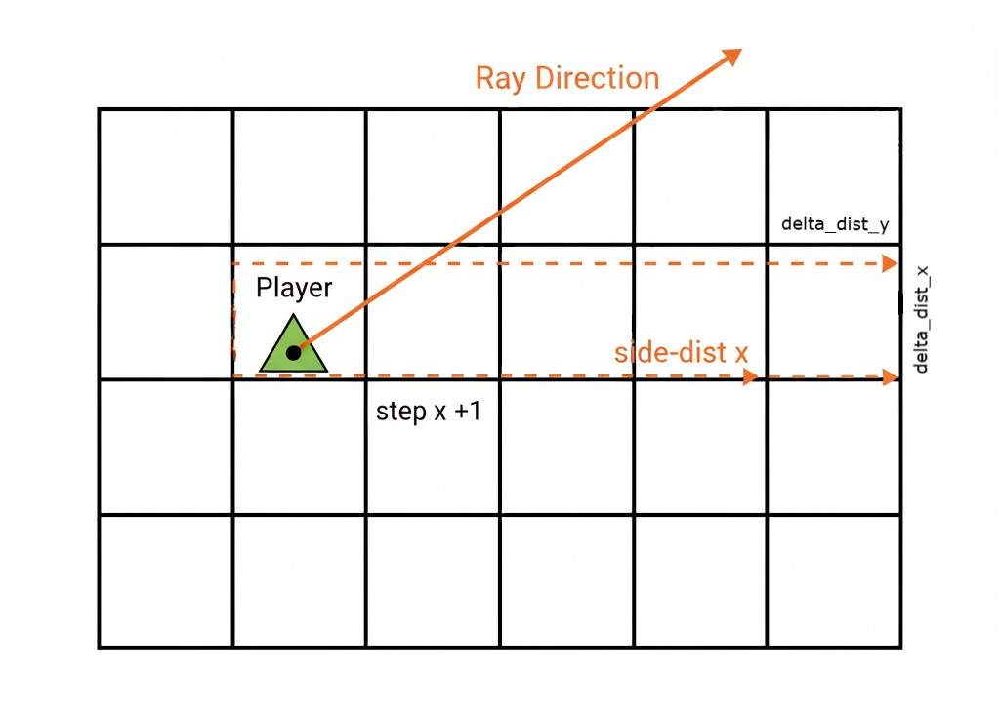
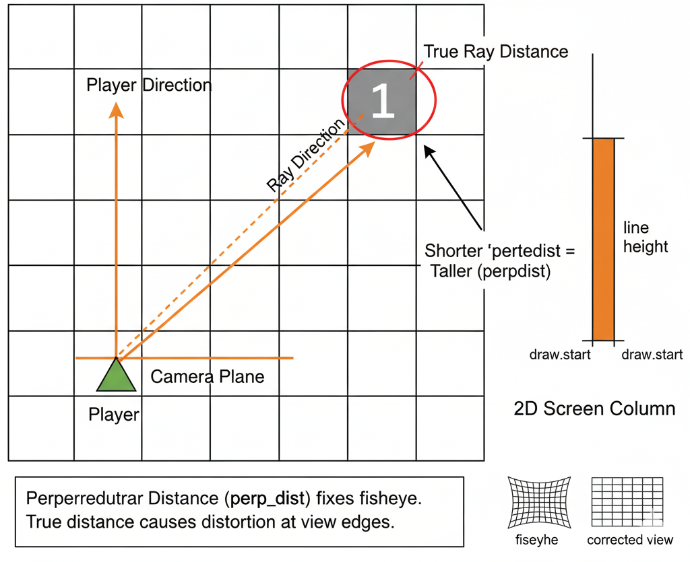
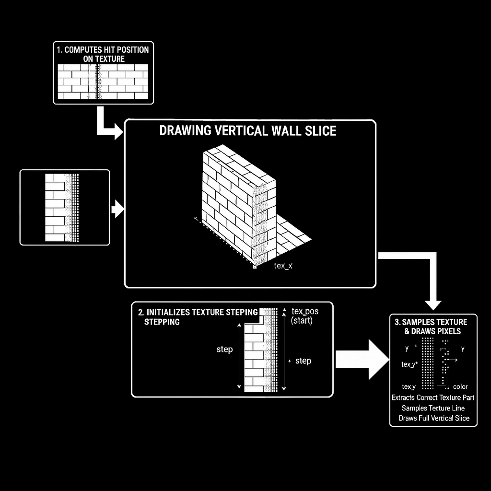

----
## Notice !!!

- This Game Does Not Segfault, No Leak, If you come across any errors, that's just a hardcoded game over message in the logic of the game.\

- And The Entire Art Of The Game is Completely Made By OussMac (NO AI).

- install glfw if the game isn't compiled when typing make.

----
# Project Clips:

Menu UI and character selection :



Game play footage :


# 1337 Ways To Die (The Game) :

1337 ways to die is the game we created for our [cub3d](https://harm-smits.github.io/42docs/projects/cub3d) project.\
You can play the game here hosted --> (Not implemented yet, clone the repo to play).

of course as our game is an actual game it needs UI and a main menu.
## Main Menu :

here you will be introduced into the UI system I'll explain later on in this documentation.\
like clickable and hover-able buttons.

- START GAME : launches the game and takes you to the in game world.
- CHARACTERS : lets you choose your starting character.
- EXIT : quits the game cleanly.



## Characters :

here you can decide your character and playing style, each character you choose\
comes with a different weapon, with different attributes like ammo and damage.



| Character | Weapon     | Damage | Ammo   | Playstyle                                |
| --------- | ---------- | ------ | ------ | ---------------------------------------- |
| Jesse     | Slingshot  | High   | low    | heavy damage but one bullet per reload.  |
| Choris    | M42 Rifle  | Low    | High   | low damage but high amount of ammo.      |
| OussMac   | 9MM Pistol | Medium | Medium | balanced playstyle, right in the middle. |

# The Game Story:

you play as a character from the previous set, no clipped out of reality, and stuck in\
a computer dimension, between the lines of code and cracks of logic, you fight these bugs.\
in order to win you have to kill all the bugs on the level.\
beware of The Segfault.
## Monsters (The Bugs) :

on these levels of the architecture, these are the entities you will come across, each entity\
upon death has a chance to drop a medkit to replenish health.\
and each deal different damage, the more sever the bug the higher the damage.



| Bug           | Damage | Health | Chance To Drop Medkit |
| ------------- | ------ | ------ | --------------------- |
| Garbage Value | 15     | 42     | 30%                   |
| Memory Leak   | 20     | 70     | 50%                   |
| Segfault      | 37     | 101    | 69%                   |

# Game Play :


## Controls :

| Control     | Function           |
| ----------- | ------------------ |
| W           | Move Forward       |
| S           | Move Backwards     |
| A           | Strafe Left        |
| D           | Strafe Right       |
| Shift       | Running            |
| Left Arrow  | Rotate Left        |
| Right Arrow | Rotate Right       |
| Mouse       | To Look Around     |
| Left Mouse  | Shoot              |
| Right Mouse | Aim                |
| Esc         | Back or Leave Game |
| E           | Open Door          |
| R           | Reload Weapon      |

# How To Install and play :

simply clone this repository and cd to it, and make:

```
git clone https://github.com/Undeved/cube3d && cd cube3d
```

```sh
# make the game executable
make all clean
# usuage ./cub3d <map_path>.cub
./cub3d maps/jesse.cub
```

Note : install glfw if you don't have it.
# Code Documentation

## The Parsing :

This is Where My part begins, (OussMac), first i go about parsing the input file and extracting\
all the information needed for the game.

### Evaluating Input

Here I evaluate the input from the user to validate if it is a valid map `<map>.cub`\
i use a simple logic of reverse string search `ft_strrchr` , on the `.` and simply\
compare this using `ft_strcmp` to have `.cub`.

```c
// this happens in my evaluate_input.c
void	evaluate_input(int argc, char **argv)
{
	if (argc != 2)
		// Must be exactly program name and map, Exit.
	if (ft_strcmp(ft_strrchr(argv[1], '.'), ".cub") != 0)
		// If last '.' isn't exactly .cub, Exit.
}
```

This is the first function called in the main logic and then we move on into reading\
the file.

```c
int	main(int argc, char **argv)
{
	t_cube	cube;

	evaluate_input(argc, argv); // --> evaluating file input.
	parse_map(argv[1], &cube);  // --> parsing file.
	game_loop(&cube.pd);        // --> launching game.
	return (mind_free_all(EXIT_SUCCESS), EXIT_SUCCESS); // clean and exit.
}
```
### Reading File :

I get a path to a `<file>.cub`, which i open with the sys call `open()`\
and in `parse_map.c` i started reading the file

```c
int fd = open(map_path, O_RDONLY);
```

using the stored file descriptor, i can access the file contents and read them using\
my `get_next_line();` function.

and read each line and trim new lines `\n` afterwards, this leaves me with clean data i can use to structure the world.

example of a file we read.

```css
NO txt/wall_textures/wall.png
EA txt/wall_textures/wall4.png
SO txt/wall_textures/wall2.png
WE txt/wall_textures/wall3.png

F 220,100,0
C 225,30,0

111111
1001X1
1N0001
111111
```

and we read the file like shown in this animation, of course this is a simplified\
example and simple parsed data structure, i have other info that i utilize as we go.


## Game World Structure:

Now from the parsed data we have a grid matrix in the form of a 2D char array.

```c
// grid matrix.
char **map_grid = {
[1, 1, 1, 1, 1, 1]
[1, 0, 0, 1, X, 1]
[1, N, 0, 0, 0, 1]
[1, 1, 1, 1, 1, 1] }
```

we can use this 2d array of characters to represent our 2D game world.\
because the world of cub3d is in fact just an illusion a 3d visual of a 2d world\
and all the logic is on a 2d grid.

along with the other data like textures for the walls, and floor and ceiling colors.

Building the world essentially comes down to two nested while loops, iterating over\
the grid and rendering each block as necessary either in 2D `(Minimap)`, or 3D `(Raycasted)`

```c
int x;
int y;
char **grid;

y = 0;
while (grid[y])
{
	x = 0;
	while (grid[y][x])
	{
		draw_block(grid[y][x]);
		x++;
	}
	y++;
}
```

this constructs the world for me like seen here


- \[1] - Walls.
- \[0] - Walk able space.
- \[X] - Enemy (Garbage Value).
- \[Y] - Enemy (Memory Leak).
- \[Z] - Enemy (Segfault).
- \[N] - Player, can also be `NSEW`
other chars that will be used later on.
- \[D] - Door.
- \[O] - Open Door.

now let's take a look at the UI system first then dive into how this 2D world structure\
is raycasted into a 3D world
## UI System :

### System Overview :
After validate the map and all the data needed for the world, we move on into initializing the game loop. this consists of initializing the UI system

My UI system follows a component based architecture, inspired from unity and\
follows it very loosely as i come up with ways to handle functionality on my own.\
i do try as best as i can to have it object oriented but not quite OOP



basically for each component `struct` within the ui system, it has it's own\
states, features, other `structs` within, that also have their own states, as in\
components in their own right.

for example this is the root of the UI that holds it all together.

```c
typedef struct s_parsed_data {
    t_main_menu      menu;           // Main menu components
    t_characters_ui  chars_menu;     // Character selection
    t_game_ui        game_ui;        // In-game interface
    int              ui_index;       // Current UI state (0,1,2)
    bool             game_started;   // Game session flag
    // ... other game state
} t_parsed_data;
```

- the Game_Started boolean, is a lock 🔒 used to lock the game out of acceding,\
- in game functions, and just looping through main menu ones.

**UI State Machine:**

- **State 0**: Main Menu - Initial game interface.
- **State 1**: Character Selection - Player customization.
- **State 2**: In-Game UI - Active game play interface.

These are the 3 scenes you can interact with in the game, they are components on their own.

### Components :


here are the core components i use across the span of the project.

**Raw Images :**
images are just a struct, with it's texture and image object respectively.

```c
typedef struct s_raw_img
{
	mlx_texture_t *txtr;
	mlx_image_t *img;
} t_raw_img;
```

these have their x, y , and z coordinates on the screen, a boolean to be enabled or\
disabled, and other useful data.

**Buttons :**
buttons are just like images, but the only difference is a boolean to for their hover\
state, and they always come with a hovered equivalent structure, and this boolean\
dictates which ones is to be turned on.

```c
typedef struct s_button
{
	mlx_texture_t *txtr;
	mlx_image_t *img;
	bool hoverd;
} t_button;
```

**Button States:**

- **Normal**: Default appearance
- **Hover**: Mouse-over highlight
- **Active**: Clicked/selected state

### System Workflow :


## Player Movement :

## Weapon Logic :

## Health Logic :

## Shading System :

---

## Raycasting :

Hi I'm the other guy urosaar my character in game is jesse , I will explain the rest from here.
what is **Raycasting** ?
in simple **Raycasting** is a technique where you send out an invisible straight line         (a ray) from a point and check  "what object it hits first" .
if want go deep check [**Raycasting**](https://en.wikipedia.org/wiki/Ray_casting)
### RAY SETUP :

-> here we setup camera plane and compute the ray direction && starting tile .

```c
camera_x = 2 * x / (double)screen_width - 1;
ray_dir_x = player.dir_x + player.plane_x * camera_x;
ray_dir_y = player.dir_y + player.plane_y * camera_x;

map_x = (int)player.pos_x;
map_y = (int)player.pos_y;

```

- Determines where the ray goes  
- Picks starting grid cell  
- Prepared for DDA


### DDA PREPARATION :

-> here we compute step and initial distances .

```c
delta_x = fabs(1 / ray_dir_x);
delta_y = fabs(1 / ray_dir_y);

if (ray_dir_x < 0)
{
    step_x = -1;
    side_dist_x = (player.pos_x - map_x) * delta_x;
}
else
{
    step_x = 1;
    side_dist_x = (map_x + 1.0 - player.pos_x) * delta_x;
}

if (ray_dir_y < 0)
{
    step_y = -1;
    side_dist_y = (player.pos_y - map_y) * delta_y;
}
else
{
    step_y = 1;
    side_dist_y = (map_y + 1.0 - player.pos_y) * delta_y;
}

```

- Calculates how far to next grid edge  
- Chooses step direction (left/right/up/down)


### DDA LOOP (FIND WALL) :

-> here we march through the grid until we hit a wall.

```c
hit = 0;
while (!hit)
{
    if (side_dist_x < side_dist_y)
    {
        side_dist_x += delta_x;
        map_x += step_x;
        side = 0; // hit vertical side
    }
    else
    {
        side_dist_y += delta_y;
        map_y += step_y;
        side = 1; // hit horizontal side
    }

    if (map[map_y][map_x] == '1')
        hit = 1;
}
```

- Ray walks grid  
- Stops on wall tile  
- Determines if wall was vertical or horizontal


### PERP DISTANCE & WALL HEIGHT :

-> here we compute final distance and wall size .

```c
if (side == 0)
    perp_dist = (map_x - player.pos_x + (1 - step_x) / 2) / ray_dir_x;
else
    perp_dist = (map_y - player.pos_y + (1 - step_y) / 2) / ray_dir_y;

line_height = (int)(screen_height / perp_dist);

draw_start = -line_height / 2 + screen_height / 2;
draw_end = line_height / 2 + screen_height / 2;

```

- Fixes fisheye
- Converts distance → on-screen wall height



### **TEXTURE + DRAW WALL SLICE**  : 

->  here we extract correct part of texture and draw .

```c
// where exactly the wall was hit (0..1)
if (side == 0)
    wall_x = player.pos_y + perp_dist * ray_dir_y;
else
    wall_x = player.pos_x + perp_dist * ray_dir_x;
wall_x -= floor(wall_x);

// X-coordinate on texture
tex_x = (int)(wall_x * tex_width);
if (side == 0 && ray_dir_x > 0) tex_x = tex_width - tex_x - 1;
if (side == 1 && ray_dir_y < 0) tex_x = tex_width - tex_x - 1;

// how much to step in texture per pixel
step = 1.0 * tex_height / line_height;
tex_pos = (draw_start - screen_height / 2 + line_height / 2) * step;

// draw loop
for (y = draw_start; y < draw_end; y++)
{
    tex_y = (int)tex_pos & (tex_height - 1);
    tex_pos += step;
    color = texture[tex_id][tex_y][tex_x];
    put_pixel(x, y, color);
}

```

-  Computes hit position on texture
-  Samples texture line
-  Draws full vertical slice



## Medkit System :
## Enemy Logic :

